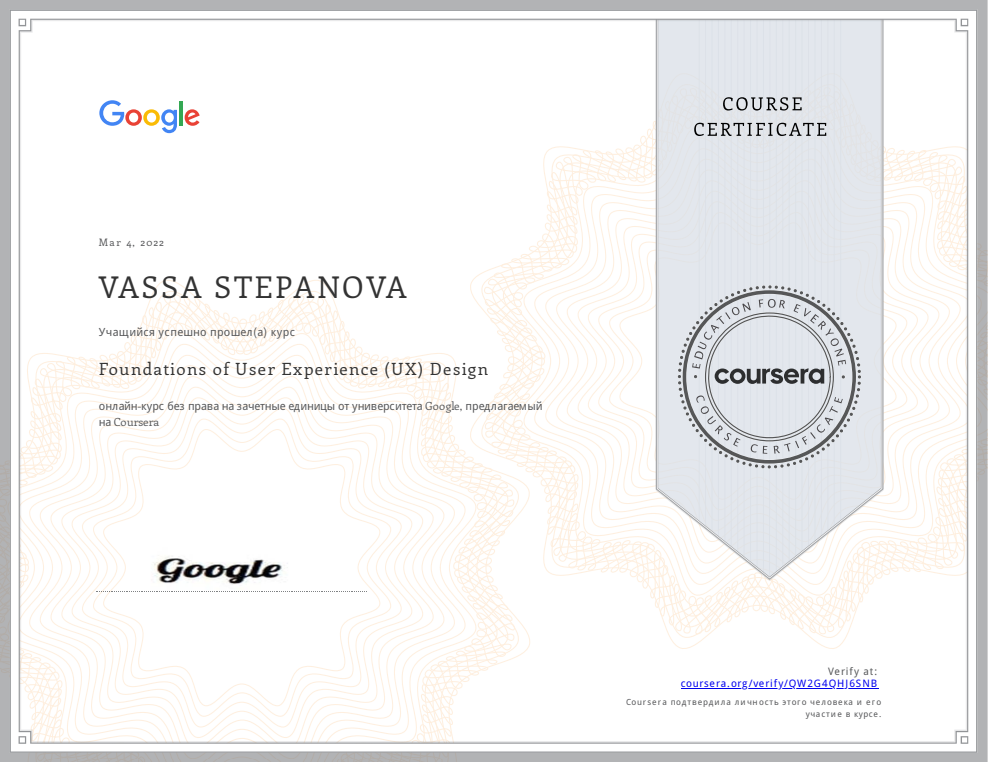

#  **Stepanova Vassa** 
  


## Contacts
*  +380976598693  
*  Vassa#8169  
*  st.vassa@gmail.com  
*  Kyiv, Ukraine  
*  <https://github.com/stvassa>  
*  <www.linkedin.com/in/stvassa> 
*  <https://www.behance.net/st_vassa>  


## About me
My work experience started with teaching, after that there were sales, and now I finally found the area in which I want to become a real pro - Web developer.
Nowadays, I'm active learning programming and User Experience Design and the main goal of my training are creating usable, cross-browser and adaptive-responsive websites. I try to use the most of opportunities of HTML and CSS to optimize the loading of the site.


## Education
* Master of Education - MEd, Borys Grinchenko Kyiv University
  * Higher School Pedagogy
* Specialist, Borys Grinchenko Kyiv University
  * Secondary school teacher *Foreign Literature and English language*
* Bachelor, Kiev City Pedagogical College №3 
  * Primary school and English teacher 


## Additional education
* Coursera - Foundations of User Experience (UX) Design 
    
* Coursera - Start the UX Design Process: Empathize, Define, and Ideate (In process)  
* GeniusSpace - Profession SEO-специалист 4.0 (free listener)  
* GeniusSpace - Profession Project manager 10.0 (free listener)  
* Projector.Humanitarium - How the composition works  


## Skilks
* Figma (for web designers)
* Adobe Illustrator (Basic)  
* Prototyping 
* User Experience Design  
* HTML  
* CSS  
* Preprocessor SASS  
* Bootstrap5  


## Code examples
Burger menu close and open

```
  const iconMenu = document.querySelector('.menu-icon');
  const menuBody = document.querySelector('.menu-body');
  if (iconMenu) {
    iconMenu.addEventListener("click", function (e) {
      iconMenu.classList.toggle('_active');
      menuBody.classList.toggle('_active');
    });
  }
```


## Experience
I have some experience in web design and development, working on small commercial and some volunteer projects.
These sites I design and developed by myself:
* <https://optimistic-keller-131bf7.netlify.app/> I use Figma, HTML, CSS(SASS), JS
* <https://moving-site.netlify.app/> I use Figma, HTML, CSS(SASS), JS, JQuery 


## Languages
1. Ukrainian (Native)
2. Russian (Native)
3. English (Advanced)

