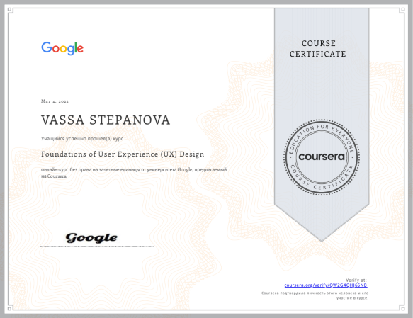

#  **Stepanova Vassa** 
  


## Contacts
 +380976598693  
 Vassa#8169  
 st.vassa@gmail.com  
 Kyiv, Ukraine  
 <https://github.com/stvassa>  
 <www.linkedin.com/in/stvassa>  
 <https://www.behance.net/st_vassa>  


## About me
I started my work experience as a teacher, after that there were sales, finally found the area where I want to be - IT. 
Nowadays, I'm active learning programming and User Experience Design and the main goal of my training are creating simple, usable, cross-browser and adaptive-responsive websites. Try to use the most of opportunities of HTML and CSS to optimize the loading of the site.
My strengths are the ability and desire to learn, build own path and also adapt to new conditions.
My goal is to become a Senior Product Designer in a 3 years, with a focus on UX and with understanding the principles of development and, if necessary, writing the code (the front-end) on my own. 
That is why I get acquainted with related fields such as SEO and project management while there is such an opportunity. I believe that a professional should understand how colleagues work in order not to interfere and improve teamwork.


## Education
* Master of Education - MEd, Borys Grinchenko Kyiv University
  * Higher School Pedagogy
* Specialist, Borys Grinchenko Kyiv University
  * Secondary school teacher *Foreign Literature and English language*
* Bachelor, Kiev City Pedagogical College №3 
  * Primary school and English teacher 


## Additional education
* Coursera - Foundations of User Experience (UX) Design 
    
* Coursera - Start the UX Design Process: Empathize, Define, and Ideate (In process)  
* GeniusSpace - Profession SEO-специалист 4.0 (free listener)  
* GeniusSpace - Profession Project manager 10.0 (free listener)  
* Projector.Humanitarium - How the composition works  


## Skilks
* Figma (for web designers)
* Adobe Illustrator (Basic)  
* Prototyping 
* User Experience Design  
* HTML  
* CSS  
* Preprocessor SASS  
* Bootstrap5  


## Code examples
Burger menu close and open

```
  const iconMenu = document.querySelector('.menu-icon');
  const menuBody = document.querySelector('.menu-body');
  if (iconMenu) {
    iconMenu.addEventListener("click", function (e) {
      iconMenu.classList.toggle('_active');
      menuBody.classList.toggle('_active');
    });
  }
```


## Experience
I have some experience in web design and development, working on small commercial and some volunteer projects.
These sites I design and developed by myself:
* <https://optimistic-keller-131bf7.netlify.app/> Used Figma, HTML, CSS(SASS), JS
* <https://moving-site.netlify.app/> Used Figma, HTML, CSS(SASS), JS, JQuery 


## Languages
1. Ukrainian (Native)
2. Russian (Native)
3. English (Advanced)

